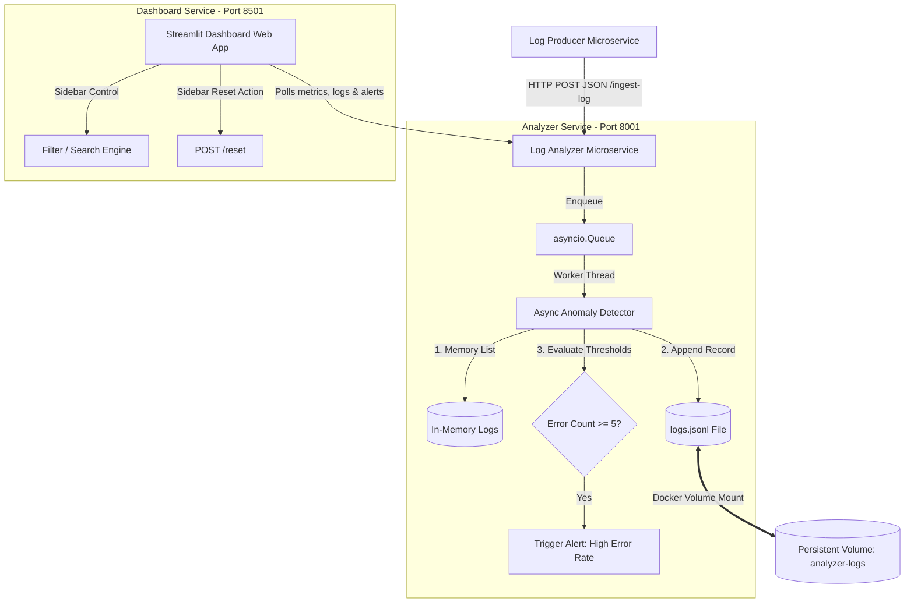

# 🚀 Cloud Log Monitoring System

A containerized, real-time observability and telemetry analytics microservices pipeline. This system generates live event streams, processes them asynchronously, stores logs in persistent JSON Lines format, runs automated anomaly detection rules, and visualizes system health on a comprehensive 8-panel Streamlit dashboard.

---

## 📌 Table of Contents
1. [System Architecture](#-system-architecture)
2. [Prerequisites](#-prerequisites)
3. [Quick Start & Setup](#-quick-start--setup)
4. [Deployment & Orchestration (`deploy.sh`)](#-deployment--orchestration-deploysh)
5. [Microservices Deep-Dive](#-microservices-deep-dive)
    - [Log Producer](#1-log-producer)
    - [Log Analyzer](#2-log-analyzer)
    - [Streamlit Dashboard](#3-streamlit-dashboard)
6. [API Endpoint Reference](#-api-endpoint-reference)
7. [CI/CD Pipeline & Smoke Tests](#-cicd-pipeline--smoke-tests)
8. [Troubleshooting & FAQs](#-troubleshooting--faqs)
9. [Future Roadmap](#-future-roadmap)
10. [License](#-license)

---

## 🏗️ System Architecture

The project is structured as a decoupled microservices architecture orchestrating three core containers:



---

## 📋 Prerequisites

Before running the application, ensure your environment meets the following requirements:
*   **Operating System**: Windows 10/11, macOS, or Linux.
*   **Docker Desktop**: Installed and running (v20.10+).
*   **Python**: Version `3.10` or higher (only required for local native testing outside Docker).
*   **Git**: For checking out the code.

---

## 🚀 Quick Start & Setup

### 1. Clone the Repository
```bash
git clone https://github.com/Mazhar26/Cloud-log.git
cd Cloud-log
```

### 2. Launch the Stack (Docker Compose)
To start all services in detached mode:
```bash
docker compose up --build -d
```
This spins up:
*   **Analyzer** at [http://localhost:8001](http://localhost:8001)
*   **Producer** (runs internally, sending telemetry to the Analyzer)
*   **Streamlit Dashboard** at [http://localhost:8501](http://localhost:8501)

### 3. Verify Container Statuses
```bash
docker compose ps
```

### 4. Stop Services
```bash
docker compose down -v
```

---

## 🛠️ Deployment & Orchestration (`deploy.sh`)

A dedicated container orchestration script is included in the project root to manage the container lifecycle.

Make the script executable (Mac/Linux):
```bash
chmod +x deploy.sh
```

### Command Usage
*   **Build and start all services**:
    ```bash
    ./deploy.sh --up
    ```
*   **Check status of running containers**:
    ```bash
    ./deploy.sh --status
    ```
*   **Tail logs from all services in real time**:
    ```bash
    ./deploy.sh --logs
    ```
*   **Run integration smoke tests**:
    ```bash
    ./deploy.sh --verify
    ```
*   **Restart the service stack**:
    ```bash
    ./deploy.sh --restart
    ```
*   **Stop services and clean up volumes**:
    ```bash
    ./deploy.sh --down
    ```

---

## 🔍 Microservices Deep-Dive

### 1. Log Producer
*   **File location**: [producer/main.py](file:///d:/Projects/Cloud-Log/producer/main.py)
*   **Description**: Simulates production log output by dispatching HTTP POST events to the Analyzer.
*   **Throughput**: Runs continuously, producing **1 log event per second** (60 events/minute).
*   **Metadata distribution**: Dispatches messages with randomized severities: `INFO`, `WARNING`, and `ERROR`.

### 2. Log Analyzer
*   **File location**: [analyzer/main.py](file:///d:/Projects/Cloud-Log/analyzer/main.py)
*   **Asynchronous Engine**: Employs an `asyncio.Queue` mechanism to accept logs instantly at `/ingest-log`, decoupling request ingestion from back-end file writes and evaluation logic.
*   **State Persistence**: Outputs structured JSON lines to a persistent volume file (`logs.jsonl`). Upon startup, the container reads this file to reconstruct past metrics and alert states.
*   **Anomaly detection**: Triggers a system alert once the cumulative `ERROR` count exceeds the threshold of 5.

### 3. Streamlit Dashboard
*   **File location**: [frontend/app.py](file:///d:/Projects/Cloud-Log/frontend/app.py)
*   **UI Refresh Rate**: Auto-polls the Analyzer endpoints every 2 seconds.
*   **8 Panel Layout Details**:
    1.  **System Health Status Banner**: Colored panel flashing "SYSTEM STABLE" (green) or "ALERT ACTIVE" (red).
    2.  **Total Ingestion Volume Card**: Metric panel reflecting total logs processed.
    3.  **Total Error Volume Card**: Metric panel showing errors alongside the calculated error percentage rate.
    4.  **Data Anomaly Alerts Card**: Informational card showing active warnings.
    5.  **Log Level Distribution Chart**: Interactive bar chart displaying count per severity.
    6.  **Ingest Time-Series Timeline Chart**: Live line chart plotting log traffic.
    7.  **Interactive Search & Filtering Panel**: Sidebar panel for text matching and log level selection.
    8.  **Real-time Log Stream Data Profile**: Sortable tabular view containing the raw log records.

---

## 🔌 API Endpoint Reference

All endpoints are hosted by the **Analyzer** microservice on port `8001`:

### 1. Health Check
*   **Route**: `GET /`
*   **Response**: `{"message": "Analyzer Service Running 🚀"}`

### 2. Ingest Log Event
*   **Route**: `POST /ingest-log`
*   **Payload**:
    ```json
    {
      "level": "ERROR",
      "message": "Critical database connection failure."
    }
    ```
*   **Response**: `{"status": "log received"}`

### 3. Get Logs Stream
*   **Route**: `GET /logs`
*   **Response**: Returns the last 50 processed log entries.

### 4. Get Statistics
*   **Route**: `GET /stats`
*   **Response**:
    ```json
    {
      "total_logs": 128,
      "error_count": 4
    }
    ```

### 5. Get Alert State
*   **Route**: `GET /alerts`
*   **Response**: `{"alert": "🚨 High error rate detected!"}` (or `null`)

### 6. Reset Log Store
*   **Route**: `POST /reset`
*   **Response**: `{"status": "reset successful"}` (clears in-memory list and deletes `logs.jsonl` from disk).

---

## 🤖 CI/CD Pipeline & Smoke Tests

The project is integrated with GitHub Actions through [.github/workflows/ci.yml](file:///d:/Projects/Cloud-Log/.github/workflows/ci.yml).

### Integration Test Flow:
1.  Initiates Docker Compose environment.
2.  Sets up Python virtual runtime.
3.  Executes the automated test script at [tests/smoke_test.py](file:///d:/Projects/Cloud-Log/tests/smoke_test.py):
    - Sends a `POST /reset` request.
    - Asserts stats are zeroed out.
    - Dispatches 5 logs to verify ingestion and check in-memory counter accuracy.
    - Dispatches 4 additional errors to exceed the threshold (total 5 errors) and asserts that an alert is successfully generated.
4.  Pings the Streamlit dashboard on port `8501` to ensure frontend availability.
5.  Tears down and cleans up services.

---

## 🚨 Troubleshooting & FAQs

### Q: "Uvicorn failed to bind: Port 8001 or 8501 is already in use"
**A**: Ensure no local instance of Streamlit or FastAPI is running. You can stop conflicting compose stacks by running `docker compose down`.

### Q: "Logs do not appear to persist across restarts"
**A**: Verify that the Docker volume mount is configured correctly. Run `docker volume inspect cloud-log_analyzer-logs` to confirm the persistent storage mount.

### Q: "The Streamlit UI shows 'Connecting to Analyzer microservice...'"
**A**: This indicates the frontend cannot reach the analyzer. Check if the analyzer service is running via `docker compose ps` and verify network configurations.

---

## 🗺️ Future Roadmap
*   **Log Indexing Integration**: Integrate Elasticsearch/Kibana for full-text search capability.
*   **Alert Notifications**: Wire Slack/Email webhook triggers inside the anomaly detector task.
*   **Authentication**: Add OAuth2/JWT middleware security boundaries around log ingestion endpoints.
*   **Metrics Exporters**: Integrate Prometheus metrics exporter.

---

## 📄 License
This project is open-source and licensed under the MIT License.
